<p align="center">
  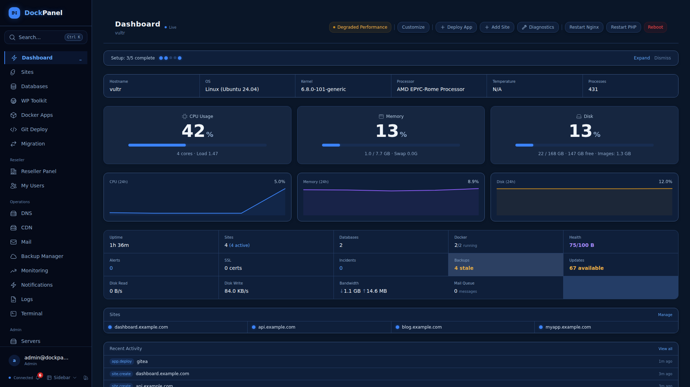
</p>

<h1 align="center">DockPanel</h1>

<p align="center">
  <strong>The most feature-packed free server panel ever built.</strong><br>
  Self-hosted. Docker-native. Written in Rust. ~57MB RAM. 371 API endpoints. 54 app templates. 116 E2E tests. ~41MB binaries. Zero subscriptions.
</p>

<p align="center">
  <a href="https://github.com/ovexro/dockpanel/releases"></a>
  <a href="https://github.com/ovexro/dockpanel/actions"></a>
  <a href="LICENSE"></a>
  <a href="https://demo.dockpanel.dev"></a>
</p>

<p align="center">
  <a href="https://demo.dockpanel.dev">Live Demo</a> &bull;
  <a href="https://dockpanel.dev">Website</a> &bull;
  <a href="https://docs.dockpanel.dev">Docs</a> &bull;
  <a href="CHANGELOG.md">Changelog</a> &bull;
  <a href="https://github.com/ovexro/dockpanel/discussions">Discussions</a>
</p>

---

## Install

```bash
curl -sL https://dockpanel.dev/install.sh | sudo bash
```

Open `http://YOUR_SERVER_IP:8443`, create your admin account, done.

Supports Ubuntu 20+, Debian 11+, CentOS 9+, Rocky 9+, Fedora 39+, Amazon Linux 2023. x86_64 and ARM64.

## Why DockPanel?

No other free panel gives you Git push-to-deploy with blue-green zero-downtime updates, 54 one-click Docker app templates, multi-server management, reseller accounts, a developer CLI, and Infrastructure as Code — all running on ~57MB of RAM. DockPanel does.

| | DockPanel | HestiaCP | CloudPanel | RunCloud |
|---|---|---|---|---|
| **Price** | **Free** | Free | Free | $8/mo+ |
| **Stack** | **Rust + React** | PHP | PHP | PHP (SaaS) |
| **Docker native** | **54 templates** | No | No | No |
| **Git deploy** | **Blue-green, zero-downtime** | No | No | Basic |
| **Multi-server** | **Unlimited** | No | No | Yes |
| **Reseller + white-label** | **Yes** | No | No | No |
| **CLI + IaC** | **Full CLI + YAML export** | Limited | No | No |
| **RAM usage** | **~57MB** | ~200MB+ | ~150MB+ | SaaS |
| **ARM64 / Homelab** | **Yes** | Partial | No | No |
| **Self-hosted** | **Yes** | Yes | Yes | No |

## Screenshots

All screenshots use the **Clean** (light) theme.

<details>
<summary><strong>Sites</strong> — Static, PHP, Node.js, Python, reverse proxy with Nginx + SSL</summary>

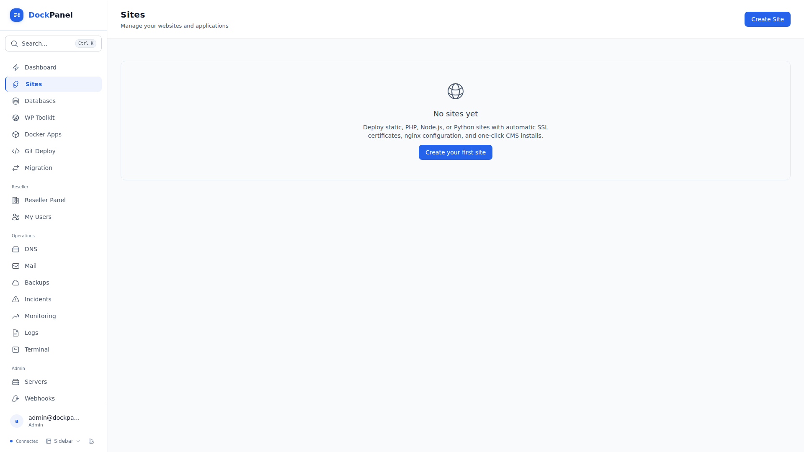
</details>

<details>
<summary><strong>Docker Apps</strong> — 54 one-click templates across 10 categories</summary>

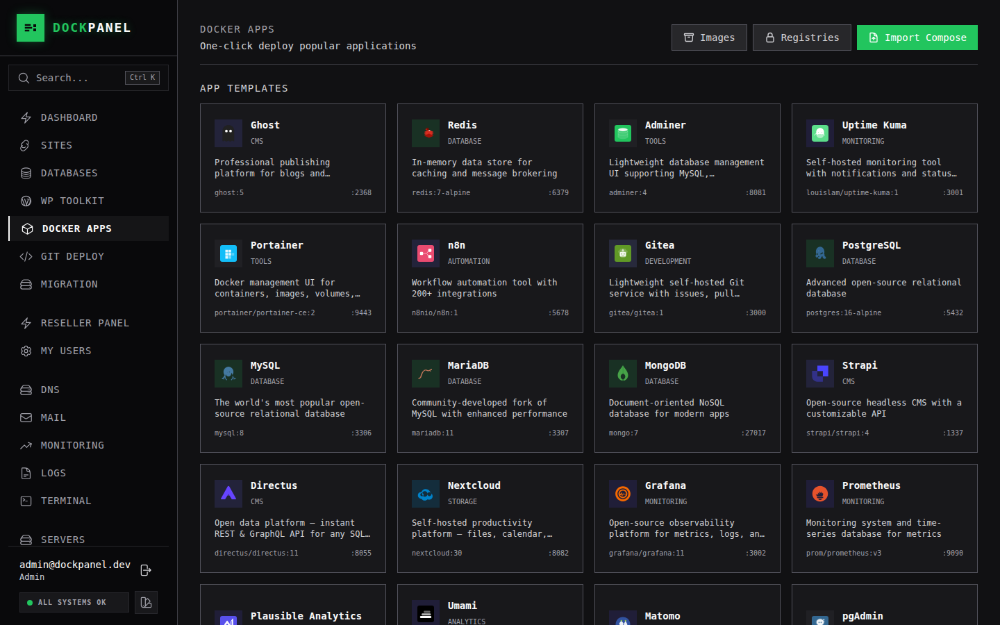
</details>

<details>
<summary><strong>Backup Orchestrator</strong> — DB/volume backups, AES-256 encryption, restore verification, policies</summary>

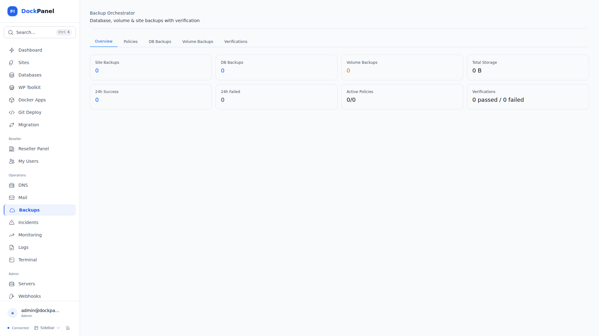
</details>

<details>
<summary><strong>Secrets Manager</strong> — AES-256-GCM encrypted vaults, version history, auto-inject to .env</summary>

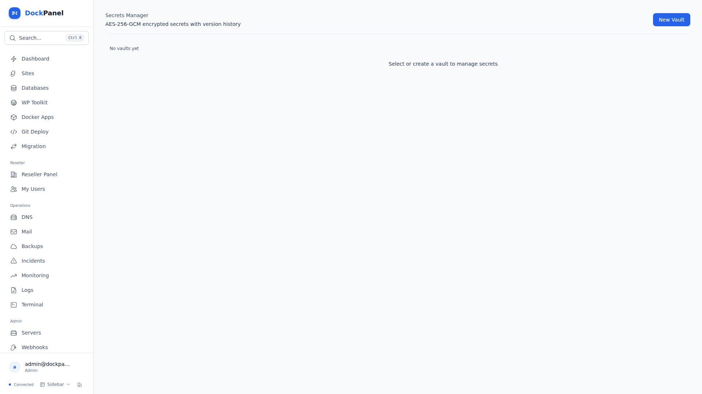
</details>

<details>
<summary><strong>Webhook Gateway</strong> — Inbound endpoints, HMAC verification, request inspector, route builder</summary>

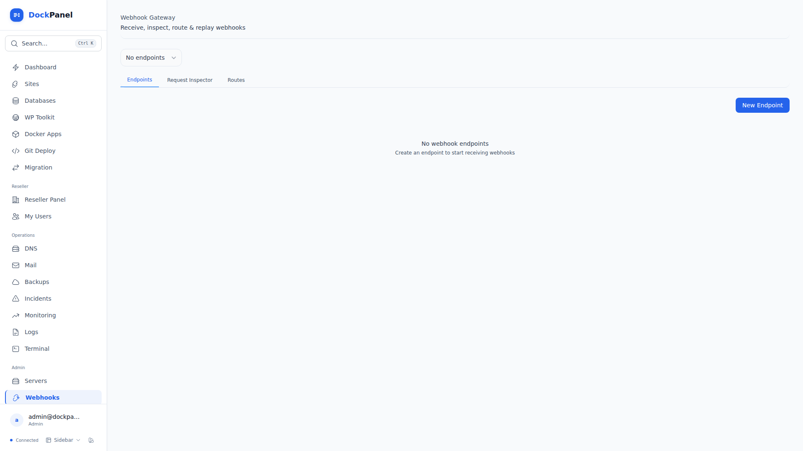
</details>

<details>
<summary><strong>Incident Management</strong> — Full lifecycle, severity levels, timeline, affected components</summary>

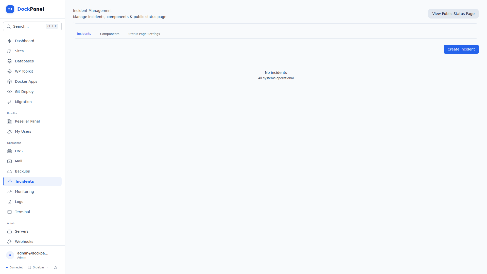
</details>

<details>
<summary><strong>Public Status Page</strong> — Standalone dark-themed page, component groups, email subscribers</summary>

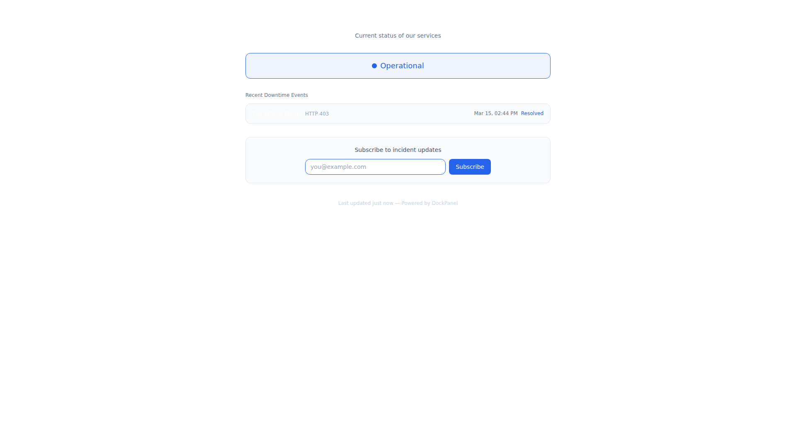
</details>

<details>
<summary><strong>Monitoring</strong> — HTTP/TCP/ping uptime checks, SLA tracking, PagerDuty integration</summary>

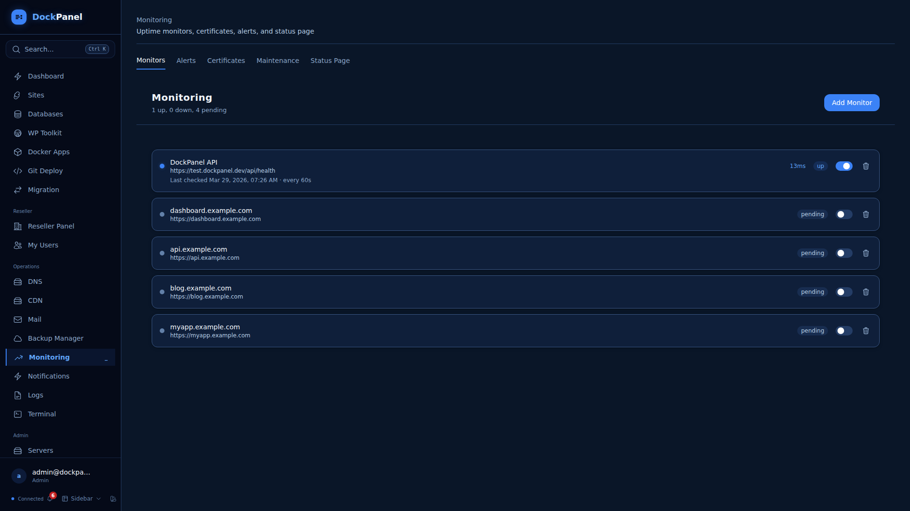
</details>

<details>
<summary><strong>Security</strong> — Firewall, Fail2Ban, SSH hardening, vulnerability scanning</summary>

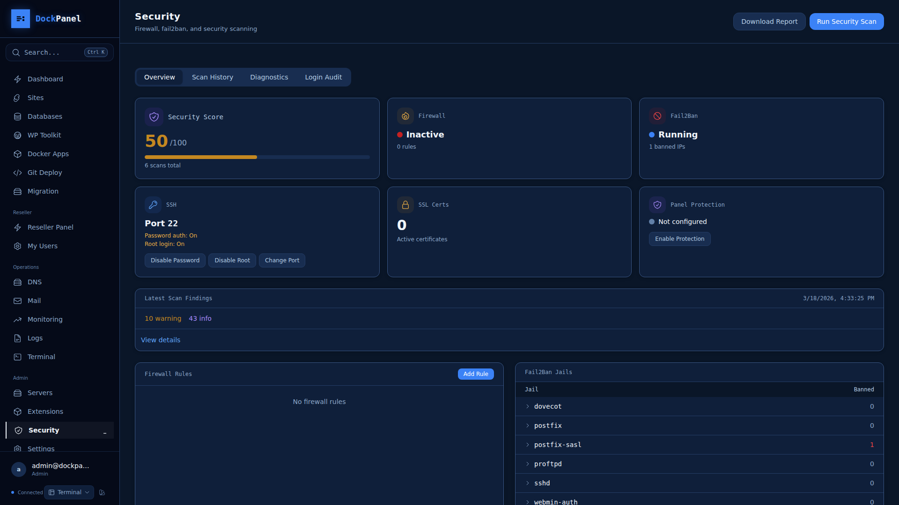
</details>

<details>
<summary><strong>DNS Management</strong> — Cloudflare + PowerDNS, zone templates, propagation checker</summary>

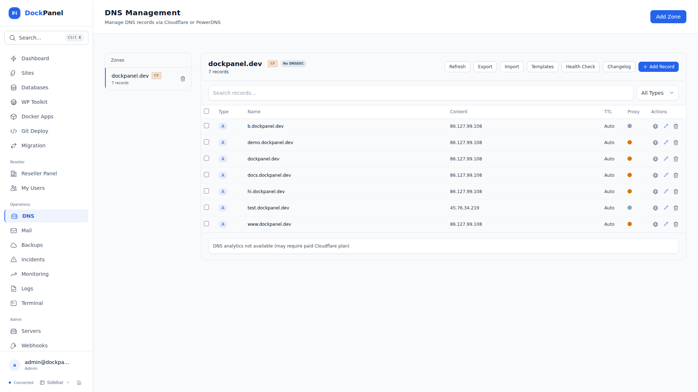
</details>

<details>
<summary><strong>Mail</strong> — Postfix + Dovecot + DKIM, Roundcube webmail, Rspamd spam filter</summary>

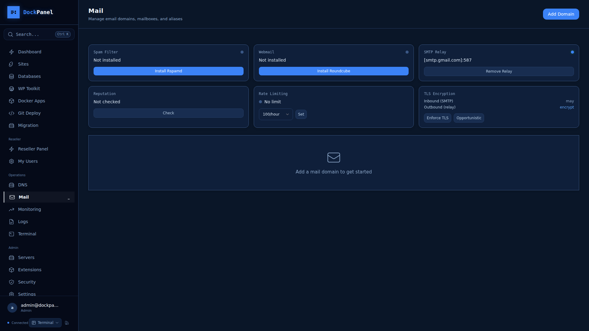
</details>

<details>
<summary><strong>Terminal</strong> — Full SSH in the browser with tabs, themes, session recording</summary>

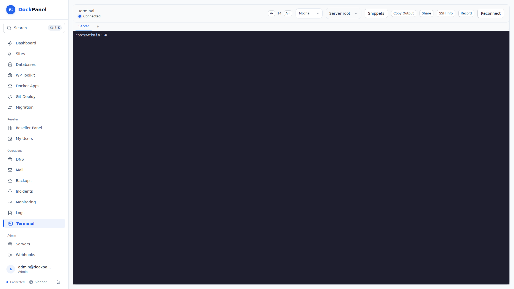
</details>

<details>
<summary><strong>Settings</strong> — Auto-healing, reverse proxy choice, timezone, notifications</summary>

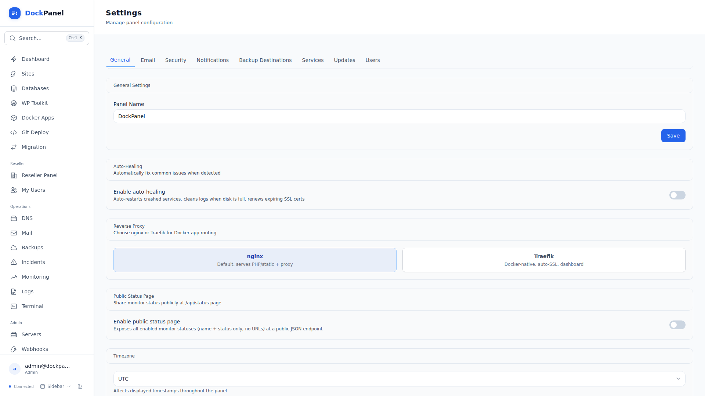
</details>

## Features

### Hosting
- **Sites** — Static, PHP (8.1-8.4), Node.js, Python, reverse proxy. Automatic Nginx config, SSL, PHP-FPM pools.
- **Databases** — MySQL/PostgreSQL in Docker. Built-in SQL browser. Auto-cleanup on site delete.
- **Docker Apps** — 54 templates (WordPress, Redis, PostgreSQL, Grafana, n8n, Gitea...). Compose stacks. Resource limits.
- **Git Deploy** — Push-to-deploy. Blue-green zero-downtime updates. Nixpacks (30+ languages). Preview environments.
- **WordPress Toolkit** — Multi-site dashboard, vulnerability scanning, security hardening, bulk updates.
- **CMS Install** — WordPress, Laravel, Drupal, Joomla, Symfony, CodeIgniter — one click.
- **Backups** — Scheduled, S3/SFTP remote destinations, one-click restore.
- **Backup Orchestrator** — DB/volume backups, AES-256 encryption, restore verification, cross-resource policies, S3/SFTP/B2/GCS destinations, health dashboard.
- **Secrets Manager** — AES-256-GCM encrypted vaults, version history, auto-inject to .env, masked API, CLI pull endpoint.
- **Webhook Gateway** — Inbound endpoints with unique URLs, HMAC-SHA256/SHA1 verification, request inspector, route builder, retry/replay.

### Operations
- **Multi-Server** — Manage remote servers from one panel. Agent auto-registers.
- **DNS** — Cloudflare + PowerDNS. Zone templates, propagation checker, DNSSEC.
- **Mail** — Postfix + Dovecot + OpenDKIM. Webmail (Roundcube), spam filter (Rspamd), SMTP relay.
- **Monitoring** — HTTP/TCP/ping uptime checks, SLA tracking, PagerDuty integration.
- **Incident Management** — Full lifecycle (investigating, identified, monitoring, resolved, postmortem), severity levels, timeline, affected components.
- **Public Status Page** — Standalone dark-themed page at `/status`, component groups, email subscribers, overall status auto-computed from checks.
- **Terminal** — Full SSH with tabs, themes, sharing, session recording.

### Security
- **2FA/TOTP** — Two-factor authentication with recovery codes.
- **Firewall** — UFW management with smart port opener.
- **Fail2Ban** — View/ban/unban IPs, panel-specific jail.
- **SSH Hardening** — Disable password/root login, change port — one click.
- **Vulnerability Scanning** — Container scanning, file integrity, security headers.
- **Auto-Healing** — Restart crashed services, clean disk, renew expiring SSL.

### Developer Experience
- **CLI** — `dockpanel status`, `sites`, `apps`, `diagnose`, `export`, `apply`
- **Infrastructure as Code** — Export/import server config as YAML.
- **Smart Diagnostics** — 6 check categories with one-click fixes.
- **File Manager** — Browse, edit, upload files from the browser.
- **Command Palette** — Ctrl+K to navigate anywhere.

### Themes & Layouts
- **6 Themes** — Terminal (hacker green), Midnight (navy blue), Ember (warm amber), Arctic (light teal), Clean (light blue SaaS), Clean Dark (GitHub-dark).
- **3 Layouts** — Sidebar (full sidebar nav), Compact (collapsible icon rail), Topbar (horizontal navbar).

### Business
- **Reseller Accounts** — Admin → Reseller → User hierarchy with quotas.
- **White-Label** — Custom logo, colors, panel name per reseller.
- **OAuth/SSO** — Google, GitHub, GitLab login.
- **Extension API** — Webhook events with HMAC signing and scoped API keys.
- **Migration Wizard** — Import from cPanel, Plesk, HestiaCP.
- **Teams** — Multi-user access with role-based permissions.

## Architecture

```
Browser → React 19 SPA → Nginx
                           ├── /api/* → API (Rust/Axum)
                           │              ├── PostgreSQL 16
                           │              └── Agent (Unix socket / HTTPS)
                           │                     └── Docker, Nginx, SSL, files, terminal
                           └── /*     → Frontend (static files)
```

**3 Rust binaries**: Agent (~20MB), API (~19MB), CLI (~1.8MB). Total RAM: ~57MB. 11 background services.

| Component | Tech | Role |
|-----------|------|------|
| Agent | Rust/Axum | Root-level host operations (Docker, Nginx, SSL, files) |
| API | Rust/Axum + SQLx | Auth, business logic, multi-server dispatch, background tasks |
| CLI | Rust/Clap | Command-line interface for automation |
| Frontend | React 19 + Vite + Tailwind 4 | Browser UI with 6 themes + 3 layouts |

## Development

```bash
git clone https://github.com/ovexro/dockpanel.git && cd dockpanel

# Start database
docker run -d --name dockpanel-postgres \
  -e POSTGRES_USER=dockpanel -e POSTGRES_PASSWORD=dockpanel -e POSTGRES_DB=dockpanel \
  -p 5450:5432 postgres:16

# Build
cargo build --release --manifest-path panel/agent/Cargo.toml
cargo build --release --manifest-path panel/backend/Cargo.toml
cargo build --release --manifest-path panel/cli/Cargo.toml
cd panel/frontend && npm install && npx vite build
```

See [CONTRIBUTING.md](CONTRIBUTING.md) for full development setup.

## CLI

```bash
dockpanel status              # Server status (CPU, RAM, disk)
dockpanel sites               # List all sites
dockpanel apps                # List Docker apps
dockpanel diagnose            # Run smart diagnostics
dockpanel export -o config.yml  # Export server config as YAML
dockpanel apply config.yml    # Apply config (Infrastructure as Code)
```

## Update / Uninstall

```bash
sudo bash /opt/dockpanel/scripts/update.sh     # Update
sudo bash /opt/dockpanel/scripts/uninstall.sh   # Remove
```

## Documentation

- [Live Docs](https://docs.dockpanel.dev) — Getting started, guides, configuration
- [FEATURES.md](FEATURES.md) — Complete feature manifest (46 features, ~215 capabilities)
- [CHANGELOG.md](CHANGELOG.md) — Version history
- [SECURITY.md](SECURITY.md) — Security model and vulnerability reporting
- [CONTRIBUTING.md](CONTRIBUTING.md) — Development setup and PR process

## License

Business Source License 1.1. Free to use on your own servers. See [LICENSE](LICENSE) for details.
