<p align="center">
  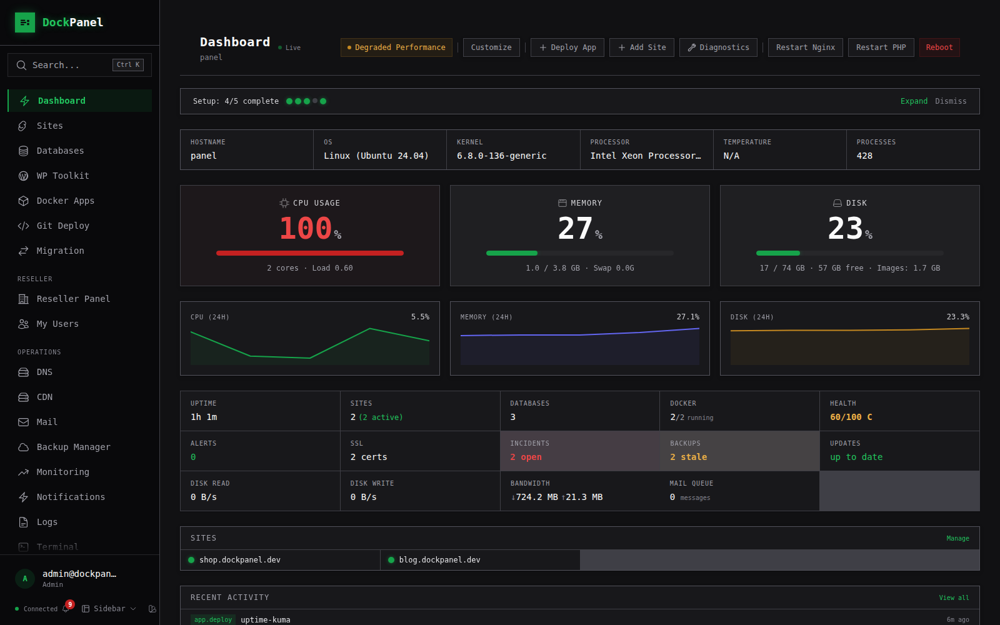
</p>

<h1 align="center">DockPanel</h1>

<p align="center">
  <strong>The most feature-packed free server panel ever built.</strong><br>
  Self-hosted. Docker-native. Written in Rust. Panel services run on <strong>~49MB of RAM</strong>. 839 HTTP routes. 147 app templates. 4285 regression assertions. ~47MB binaries. Zero subscriptions.
</p>

<p align="center">
  <a href="https://github.com/ovexro/dockpanel/releases"></a>
  <a href="https://github.com/ovexro/dockpanel/actions"></a>
  <a href="LICENSE"></a>
</p>

<p align="center">
  <a href="https://dockpanel.dev">Website</a> &bull;
  <a href="https://docs.dockpanel.dev">Docs</a> &bull;
  <a href="CHANGELOG.md">Changelog</a> &bull;
  <a href="https://github.com/ovexro/dockpanel/discussions">Discussions</a>
</p>

---

## Install

```bash
curl -sL https://dockpanel.dev/install.sh | sudo bash
```

Open `https://YOUR_SERVER_IP:8443`, create your admin account, done. Without a domain the
panel serves a self-signed certificate, so your browser warns once — it is there so the
admin password you create is encrypted on the way to the server. Point a domain at the box
and pass `PANEL_DOMAIN=your.domain` to get a trusted Let's Encrypt certificate instead.

Supports Ubuntu 20+, Debian 11+, CentOS 9+, Rocky 9+, AlmaLinux 9+, Fedora 39+. x86_64 and ARM64.
On the RHEL family the optional-service installers (Redis, Node.js, PowerDNS, WAF, Cloudflare
Tunnel) work from the panel as of v2.40.0; the mail server still refuses there, and UFW refuses
on any firewalld box by design. See [getting started](docs/getting-started.md#requirements).

## Why DockPanel?

No other free panel gives you Git push-to-deploy with blue-green zero-downtime updates, 147 one-click Docker app templates, per-image CVE scanning with deploy gating, a WAF, passkey login, GPU passthrough, multi-server management, reseller accounts, a developer CLI, and Infrastructure as Code — all while the panel services themselves use under 20MB of RAM. DockPanel does.

| | DockPanel | HestiaCP | CloudPanel | RunCloud |
|---|---|---|---|---|
| **Price** | **Free** | Free | Free | $8/mo+ |
| **Stack** | **Rust + React** | PHP | PHP | PHP (SaaS) |
| **Docker native** | **147 templates** | No | No | No |
| **Git deploy** | **Blue-green, zero-downtime** | No | No | Basic |
| **Multi-server** | **Unlimited** | No | No | Yes |
| **Reseller + white-label** | **Yes** | Reseller only | No | No |
| **CLI + IaC** | **Full CLI + YAML export** | Limited | No | No |
| **RAM usage (panel)** | **~49MB** | ~200MB+ | ~150MB+ | SaaS |
| **ARM64 / Homelab** | **Yes** | Partial | No | No |
| **Self-hosted** | **Yes** | Yes | Yes | No |

A feature table is easy to write, so here is the harder claim: before each
release DockPanel is installed on a throwaway VPS with a real domain and a real
Let's Encrypt certificate, and each journey is driven to the point where a user
would get value from it — mail is not "installed", a message is sent to another
server and its DKIM signature checked on arrival. That has repeatedly found
features whose setup half worked and whose payoff half had never once run.
[How DockPanel is tested](https://docs.dockpanel.dev/testing.html) lists what it
found, including what is still broken.

## Screenshots

<details>
<summary><strong>Dashboard</strong> — Live server metrics, 24h graphs, site overview, recent activity</summary>


</details>

<details>
<summary><strong>Sites</strong> — Static, PHP, Node.js, Python, reverse proxy with Nginx + SSL</summary>

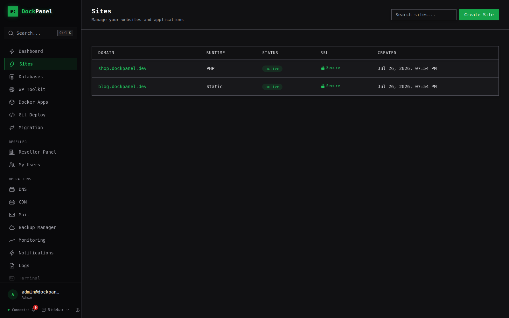
</details>

<details>
<summary><strong>Site Detail</strong> — SSL, WAF, file manager, terminal, backups, resource limits, custom nginx</summary>

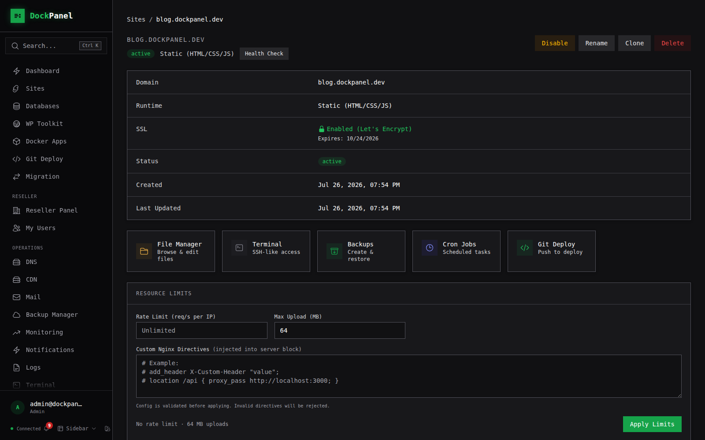
</details>

<details>
<summary><strong>Docker Apps</strong> — 147 one-click templates across 14 categories</summary>

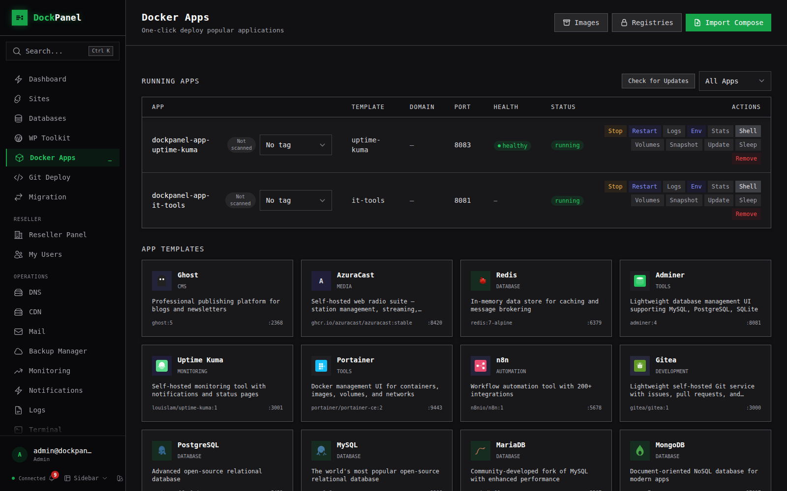
</details>

<details>
<summary><strong>Databases</strong> — MySQL/PostgreSQL, SQL browser, schema viewer, scheduled backups</summary>

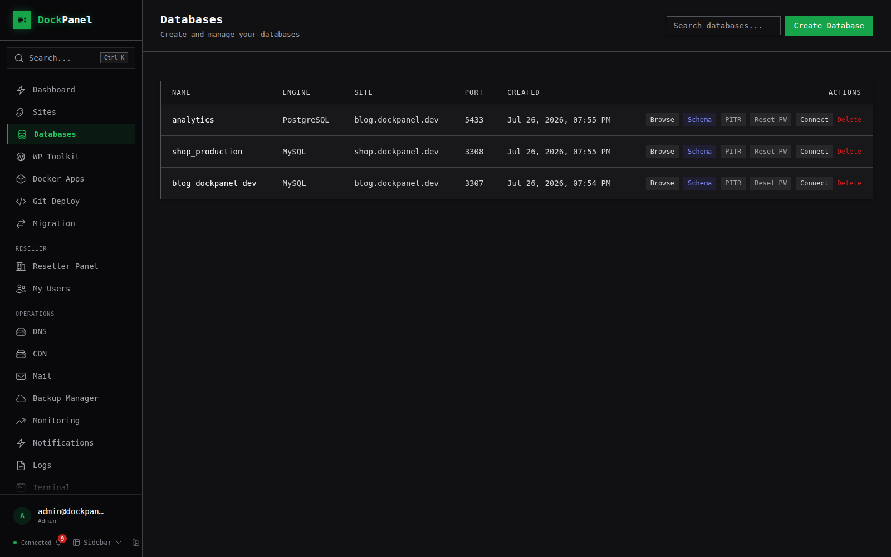
</details>

<details>
<summary><strong>File Manager</strong> — Browse, edit, upload files from the browser</summary>

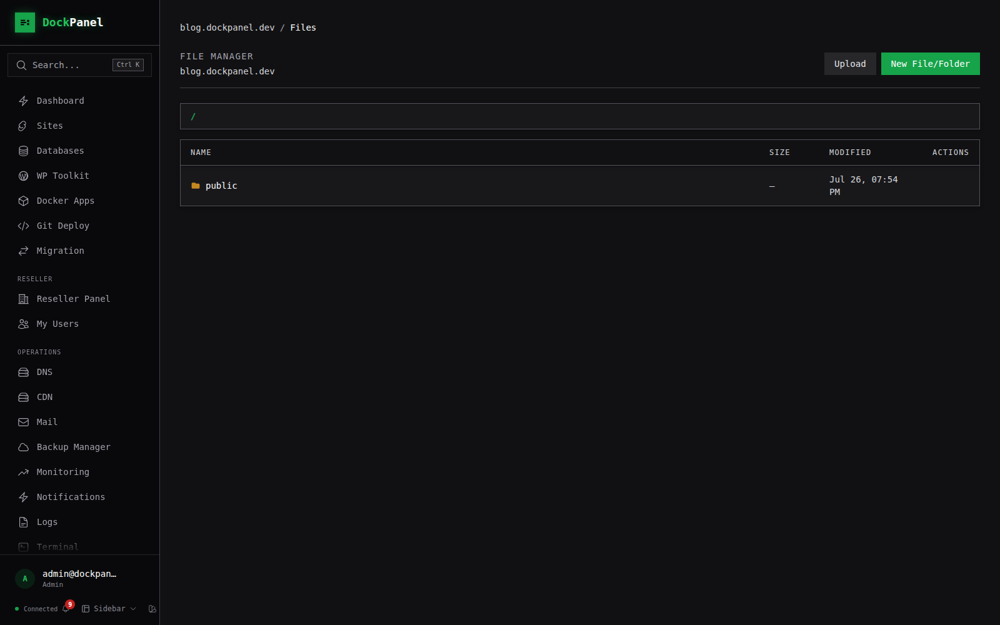
</details>

<details>
<summary><strong>Terminal</strong> — Full SSH in the browser with tabs, themes, session recording</summary>

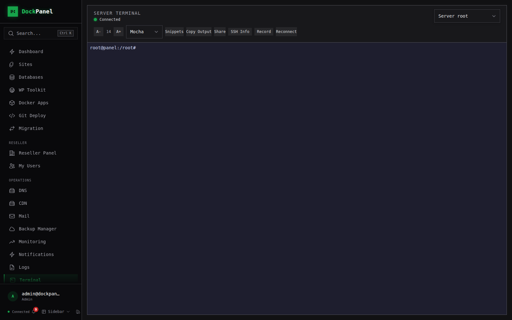
</details>

<details>
<summary><strong>Git Deploy</strong> — Push-to-deploy, atomic zero-downtime deploys, preview environments</summary>

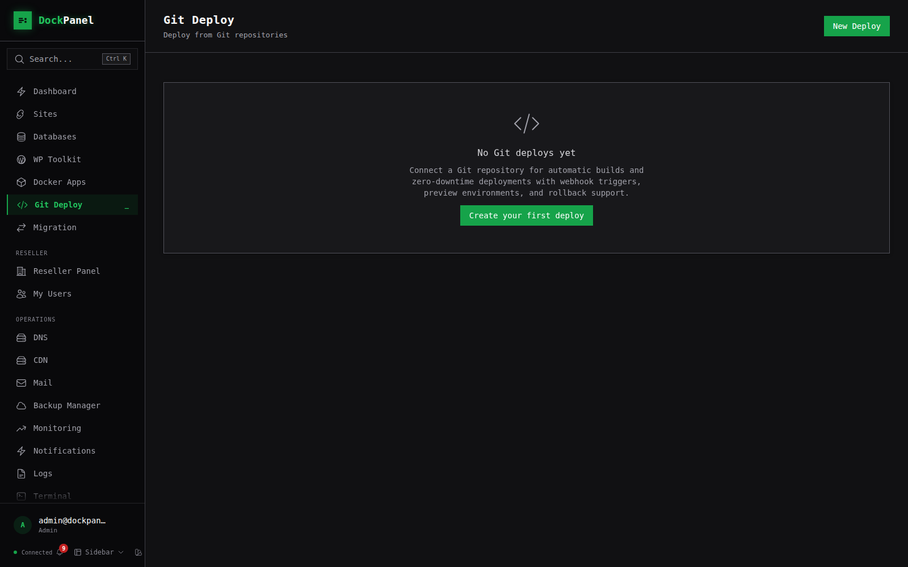
</details>

<details>
<summary><strong>Monitoring</strong> — HTTP/TCP/ping uptime checks, SLA tracking, PagerDuty integration</summary>

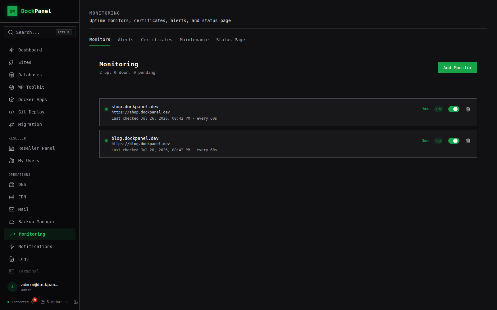
</details>

<details>
<summary><strong>Security</strong> — Firewall, Fail2Ban, SSH hardening, vulnerability scanning, audit logs</summary>

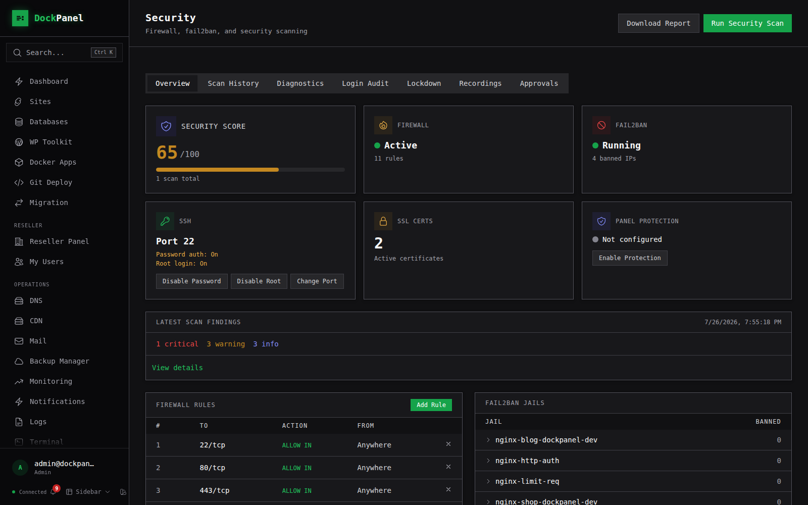
</details>

<details>
<summary><strong>Backups</strong> — Scheduled backups, S3/SFTP destinations, Restic incremental (API only), one-click restore</summary>

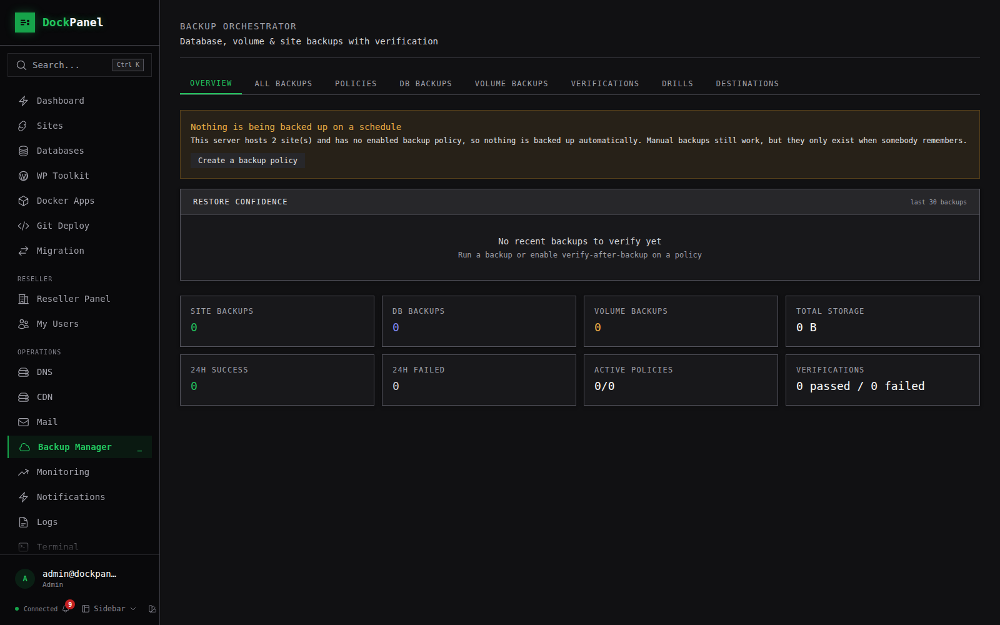
</details>

<details>
<summary><strong>DNS</strong> — Cloudflare + PowerDNS, zone management, cache purge, security settings</summary>

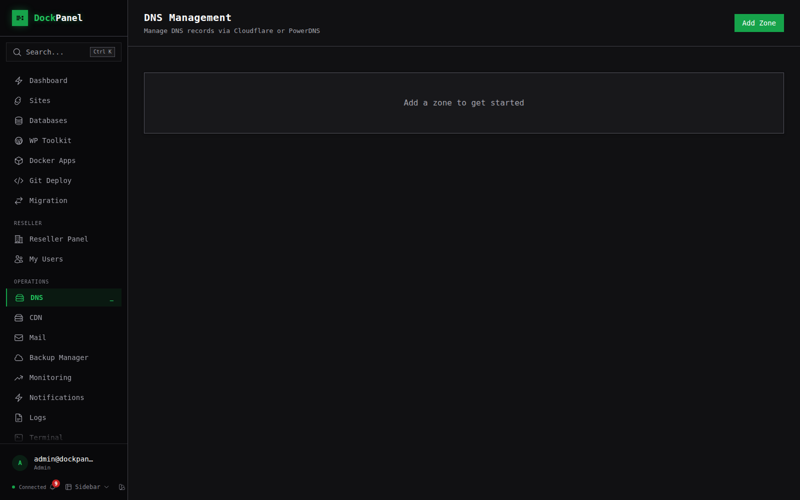
</details>

<details>
<summary><strong>Mail</strong> — Postfix + Dovecot + DKIM, Roundcube webmail, Rspamd spam filter</summary>

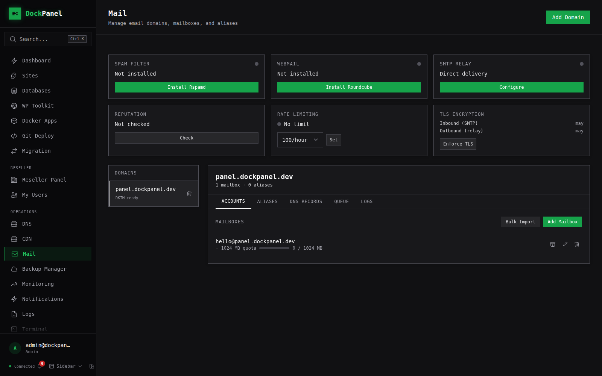
</details>

<details>
<summary><strong>Cron Jobs</strong> — Scheduled tasks with output logging</summary>

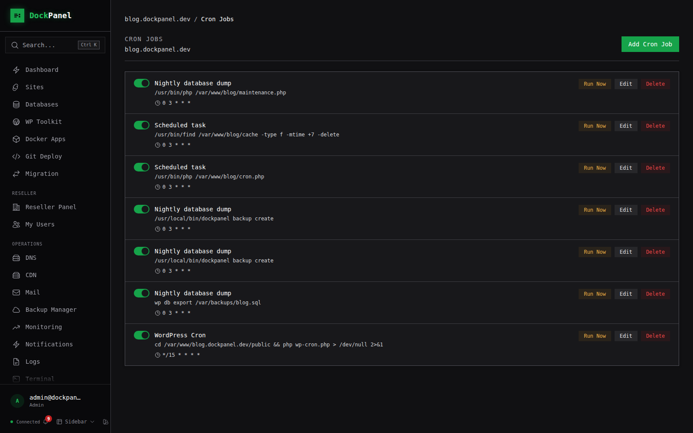
</details>

<details>
<summary><strong>System</strong> — Services, updates, diagnostics, auto-healing</summary>

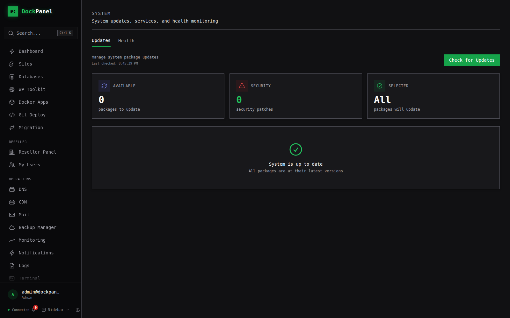
</details>

<details>
<summary><strong>Settings</strong> — Branding, notifications, alert channels, account security</summary>

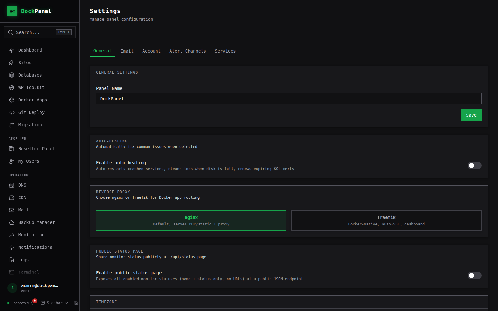
</details>

<details>
<summary><strong>Login</strong> — Email/password + passkey (WebAuthn) support</summary>

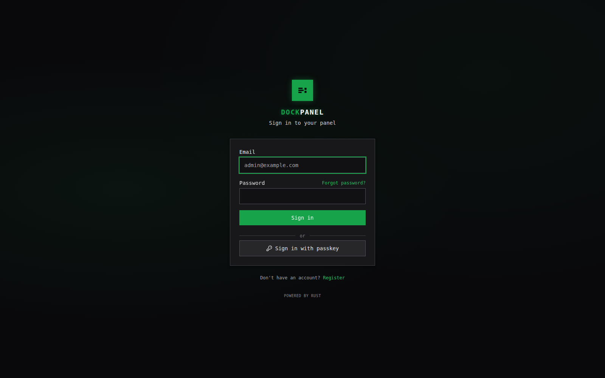
</details>

## Features

### Hosting
- **Sites** — Static, PHP (8.1–8.5), Node.js, Python, reverse proxy. Automatic Nginx config, SSL, PHP-FPM pools.
- **Databases** — MySQL/PostgreSQL in Docker. Built-in SQL browser, visual schema browser, scheduled dump/restore. Auto-cleanup on site delete.
- **Docker Apps** — 147 templates across 14 categories (AI, CMS, Database, Media, Monitoring, and more). Compose stacks. Resource limits. GPU passthrough.
- **Git Deploy** — Push-to-deploy. Atomic zero-downtime deploys (Capistrano-style). Nixpacks (30+ languages). Preview environments.
- **WordPress Toolkit** — Multi-site dashboard, vulnerability scanning, security hardening, bulk updates.
- **CMS Install** — WordPress, Laravel, Drupal, Joomla, Symfony, CodeIgniter — one click.
- **Backups** — Scheduled, S3/SFTP remote destinations, one-click restore. Restic incremental (encrypted, deduplicated) — API only, no panel UI yet.
- **Backup Orchestrator** — DB/volume backups, AES-256 encryption, restore verification, cross-resource policies, S3/SFTP/B2/GCS destinations, health dashboard.
- **CDN** — BunnyCDN and Cloudflare CDN management. Cache purge, bandwidth stats, pull zone discovery.
- **Image Optimization** — Server-side WebP/AVIF conversion per site.
- **Secrets Manager** — AES-256-GCM encrypted vaults, version history, auto-inject to .env, masked API, CLI pull endpoint.
- **Webhook Gateway** — Inbound endpoints with unique URLs, HMAC-SHA256/SHA1 verification, request inspector, route builder, retry/replay.

### Operations
- **Multi-Server** — Manage remote servers from one panel. Agent auto-registers.
- **DNS** — Cloudflare + PowerDNS. Zone templates, propagation checker, DNSSEC. Cloudflare cache purge, security settings, `cloudflared` install/uninstall.
- **Container Management** — Auto-sleep (stop idle containers), auto-update detection, per-user isolation policies.
- **Mail** — Postfix + Dovecot + OpenDKIM. Webmail (Roundcube), spam filter (Rspamd), SMTP relay.
- **Monitoring** — HTTP/TCP/ping uptime checks, SLA tracking, PagerDuty integration.
- **Prometheus + Grafana** — Token-gated `/api/metrics` scrape endpoint (off by default) plus a drop-in [fleet dashboard](dashboards/dockpanel-grafana.json) covering CPU/memory/disk, GPU utilization/VRAM/temp/power, sites, and alerts. See [docs/guides/prometheus.md](docs/guides/prometheus.md).
- **Incident Management** — Full lifecycle (investigating, identified, monitoring, resolved, postmortem), severity levels, timeline, affected components.
- **Public Status Page** — Standalone dark-themed page at `/status`, component groups, email subscribers, overall status auto-computed from checks.
- **Terminal** — Full SSH with tabs, themes, sharing, session recording.

### Security
- **Passkey/WebAuthn** — Passwordless login with biometrics or security keys. Plus 2FA/TOTP with recovery codes.
- **WAF** — ModSecurity3 + OWASP CRS v4 per site. Detection or prevention mode. Event viewer.
- **CSP & Bot Protection** — Per-site Content Security Policy headers and bot rate limiting.
- **Firewall** — UFW management with smart port opener.
- **Fail2Ban** — View/ban/unban IPs, panel-specific jail.
- **SSH Hardening** — Disable password/root login, change port — one click.
- **Vulnerability Scanning** — File integrity, security headers, full-server audits.
- **Per-Image CVE Scanning** — Scan every running Docker app's image with Anchore grype. Severity badge per app row on the Apps page. Scheduled background rescans (configurable interval). Soft deploy gate refuses images exceeding a critical/high/medium threshold — on template deploys, image changes, compose deploys and stacks alike. Grype installs self-contained into `/var/lib/dockpanel/scanners/` from the Settings UI. **Defaults to off** — opt in from Settings → Services → Image Vulnerability Scanning.
- **Signed Releases + SBOM** — Every release binary and its SPDX SBOM is signed in CI with cosign keyless via Sigstore (no long-lived signing key, recorded in the public Rekor transparency log). Verification snippet in [SECURITY.md](SECURITY.md#verifying-release-signatures).
- **Per-Image SBOM Generation** — Generate an SPDX 2.3 JSON SBOM for any deployed Docker app's image on demand (syft). Click "Download SBOM" in any app's scan drawer. Self-contained install at `/var/lib/dockpanel/scanners/syft`. **Defaults to off** — opt in from Settings → Services → SBOM Generation. Companion to image CVE scanning: composition vs. risk.
- **Auto-Healing** — Restart crashed services, clean disk, renew expiring SSL, auto-sleep idle containers.

### Developer Experience
- **CLI** — `dockpanel status`, `sites`, `apps`, `diagnose`, `export`, `apply`
- **Infrastructure as Code** — Export/import server config as YAML. A Terraform/Pulumi-shaped provider API also exists for reading site/database inventory (see [FEATURES.md](FEATURES.md#withdrawn-claims) — its tokens don't yet authenticate).
- **Smart Diagnostics** — 6 check categories with one-click fixes. Auto-optimization recommendations.
- **File Manager** — Browse, edit, upload files from the browser.
- **Command Palette** — Ctrl+K to navigate anywhere.
- **Nginx FastCGI Cache** — Per-site toggle with smart bypass for logged-in users.
- **Redis Object Cache** — Per-site isolated Redis DB with WP auto-config.

### Themes & Layouts
- **6 Themes** — Terminal (hacker green), Midnight (navy blue), Ember (warm amber), Arctic (light teal), Clean (light blue SaaS), Clean Dark (GitHub-dark).
- **3 Layouts** — Sidebar (full sidebar nav), Compact (collapsible icon rail), Topbar (horizontal navbar).

### Business
- **Reseller Accounts** — Admin → Reseller → User hierarchy with quotas.
- **White-Label** — Custom logo, colors, panel name per reseller.
- **OAuth/SSO** — Google, GitHub, GitLab login.
- **Extension API** — Webhook events with HMAC signing.
- **WHMCS Integration** — Provisioning, suspension, termination hooks. Auto-create users from billing.
- **Migration Wizard** — Import from cPanel, HestiaCP. Plesk (beta).

## Architecture

```
Browser → React 19 SPA → Nginx
                           ├── /api/* → API (Rust/Axum)
                           │              ├── PostgreSQL 16
                           │              └── Agent (Unix socket / HTTPS)
                           │                     └── Docker, Nginx, SSL, files, terminal
                           └── /*     → Frontend (static files)
```

**3 Rust binaries**: Agent (~21MB), API (~24MB), CLI (~1.7MB). Runtime RAM: ~35MB agent + ~14MB API ≈ 49MB for the panel itself; ~109MB with the bundled PostgreSQL. 15 supervised background services.

| Component | Tech | Role |
|-----------|------|------|
| Agent | Rust/Axum | Root-level host operations (Docker, Nginx, SSL, files) |
| API | Rust/Axum + SQLx | Auth, business logic, multi-server dispatch, background tasks |
| CLI | Rust/Clap | Command-line interface for automation |
| Frontend | React 19 + Vite + Tailwind 4 | Browser UI with 6 themes + 3 layouts |

## Security

DockPanel has undergone seven rounds of security auditing (280+ vulnerabilities found and fixed). Credentials are encrypted at rest with AES-256-GCM. All child processes run with sanitized environments. Per-image CVE scanning (grype) with optional deploy gating catches vulnerable images before they ship. See [SECURITY.md](SECURITY.md) for details.

## Development

```bash
git clone https://github.com/ovexro/dockpanel.git && cd dockpanel

# Start database
docker run -d --name dockpanel-postgres \
  -e POSTGRES_USER=dockpanel -e POSTGRES_PASSWORD=dockpanel -e POSTGRES_DB=dockpanel \
  -p 5450:5432 postgres:16

# Build
cargo build --release --manifest-path panel/agent/Cargo.toml
cargo build --release --manifest-path panel/backend/Cargo.toml
cargo build --release --manifest-path panel/cli/Cargo.toml
cd panel/frontend && npm install && npx vite build
```

See [CONTRIBUTING.md](CONTRIBUTING.md) for full development setup.

## CLI

```bash
dockpanel status              # Server status (CPU, RAM, disk)
dockpanel sites               # List all sites
dockpanel apps                # List Docker apps
dockpanel diagnose            # Run smart diagnostics
dockpanel export -o config.yml  # Export server config as YAML
dockpanel apply config.yml    # Apply config (Infrastructure as Code)
```

## Update / Uninstall

```bash
sudo bash /opt/dockpanel/scripts/update.sh     # Update
sudo bash /opt/dockpanel/scripts/uninstall.sh   # Remove
```

## Documentation

- [Live Docs](https://docs.dockpanel.dev) — Getting started, guides, configuration
- [How DockPanel is tested](https://docs.dockpanel.dev/testing.html) — The fresh-VPS drills, what they found, and what is still broken
- [FEATURES.md](FEATURES.md) — Complete feature manifest (60+ features, ~280 capabilities)
- [CHANGELOG.md](CHANGELOG.md) — Version history
- [SECURITY.md](SECURITY.md) — Security model and vulnerability reporting
- [CONTRIBUTING.md](CONTRIBUTING.md) — Development setup and PR process

## License

**GNU Affero General Public License v3.0.** DockPanel is free software — run it, read it,
change it, and redistribute it, on as many servers as you like, commercially included.
There is no premium tier and nothing is held back.

The one obligation the AGPL adds over the GPL: if you modify DockPanel and offer it to
other people *as a service over a network*, you have to make your modified source
available to those users. Running an unmodified copy, or running a modified copy for
yourself or your own company, obliges you nothing. See [LICENSE](LICENSE) for the full text.

Copyright © 2026 DockPanel.

## Supporting DockPanel

DockPanel is built and maintained by one developer. It has no company behind it, no
investors to answer to, no telemetry, and nothing gated — which is why the roadmap is
decided by what actually helps people running servers rather than by what converts.

If it saved you the cost of a control-panel licence, you can put some of that back:

- **[GitHub Sponsors](https://github.com/sponsors/ovexro)** — recurring, and it shows up
  on the repo
- **[PayPal](https://www.paypal.com/paypalme/ovexro)** — one-off, no account needed

What that funds, concretely: a wider fleet of test VPSes so releases are verified on more
distributions before they ship, faster turnaround on security fixes, and time for the
bigger features on the roadmap. Every version stays free either way.
